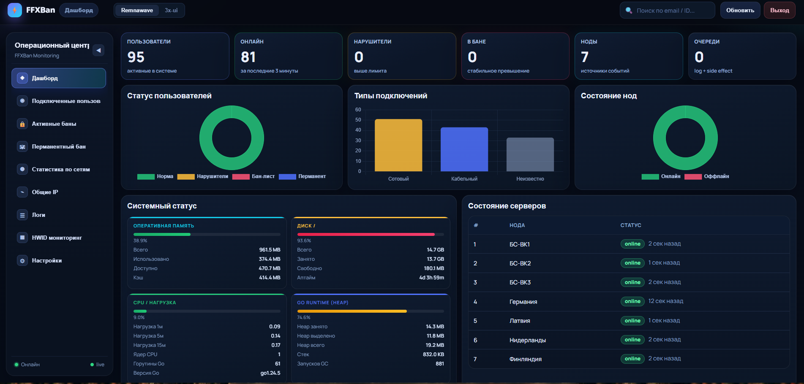

# FFXBan v1.0

FFXBan is a self-hosted anti-sharing / abuse-detection system for VPN infrastructures with support for:

- `Remnawave` mode (RabbitMQ + blocker agents + nftables)
- `3x-ui` mode (user blocking via 3x-ui API)
- Web admin panel
- Redis-based runtime tracking
- Vector-based log ingestion from nodes

## Version

- Current version: `1.0`

## Screenshots

<p align="center">
  
</p>

## What Is Included

- `ffxban/` — main Observer service (API + panel + detection logic)
- `ffxban_conf/` — Docker Compose + nginx + Vector aggregator config for Observer
- `ffxban_agent/` — Remnawave node agent (blocker-worker + Vector)
- `ffxban_agent_3xui/` — 3x-ui node agent (Vector only)
- `ffxban_blocker/` — blocker-worker source (nftables + RabbitMQ consumer)
- `ffxban_blocker_conf/` — blocker node config examples
- `docs/` — install guides and GitHub publishing/security checklist

## Documentation

- [FFXBan Observer install](docs/INSTALL_FFXBAN.md)
- [Agents install (Remnawave / 3x-ui)](docs/INSTALL_AGENTS.md)
- [GitHub security prep checklist](docs/SECURITY_AUDIT_GITHUB_PREP.md)

## Quick Start (Observer)

```bash
cp ffxban_conf/.env.example ffxban_conf/.env
# edit ffxban_conf/.env

docker build -t ffxban-remnawave:latest ./ffxban
cd ffxban
CGO_ENABLED=0 GOOS=linux GOARCH=amd64 go build -o ../ffxban_conf/ffxban-custom ./cmd/ffxban
cd ..
chmod +x ffxban_conf/ffxban-custom

cd ffxban_conf
docker compose up -d
```

Then install node agents:

- `ffxban_agent/` for Remnawave nodes
- `ffxban_agent_3xui/` for 3x-ui nodes

## Modes

## Remnawave Mode

- Ingests node traffic logs via Vector
- Uses RabbitMQ for block commands
- Uses `blocker-worker` + `nftables` on nodes
- Can pull dynamic limits/HWID from panel API (`PANEL_URL`, `PANEL_TOKEN`)

## 3x-ui Mode

- Parses `x-ui/access.log` on 3x-ui nodes
- Blocks users via 3x-ui API (`THREEXUI_SERVERS`)
- No blocker-worker required on 3x-ui nodes

## Security Notes

- Do not commit real `.env` files
- Do not commit `.claude/` local tooling config
- Rotate tokens/passwords before publishing if they were used in local testing

## Repository Notes

This repo contains a migrated/new structure under `ffxban*` directories. If you are updating an older fork, review the diff carefully before merging.
