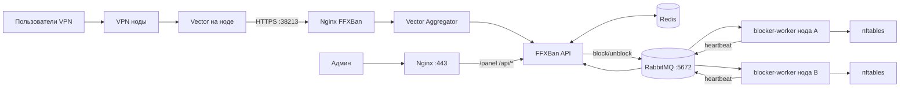

# FFXBan

<p align="center">
  <b>Self-hosted anti-sharing платформа для VPN-инфраструктуры</b><br>
  Анализирует подключения, выявляет одновременное использование аккаунтов и управляет блокировками через RabbitMQ + nftables.
</p>

---

## Содержание

- [Быстрый старт](#быстрый-старт)
- [Полная установка — сервер FFXBan](#полная-установка--сервер-ffxban)
- [Добавление ноды](#добавление-ноды)
- [Проверка после установки](#проверка-после-установки)
- [Устранение неполадок](#устранение-неполадок)
- [Основные переменные](#основные-переменные)
- [Обновление](#обновление)
- [Архитектура](#архитектура)
- [Безопасность](#безопасность)

---

## Быстрый старт

Для тех, кто уже знает что делает. Нужен сервер с Ubuntu/Debian, домен и TLS-сертификат.

```bash
# 1. Docker
curl -fsSL https://get.docker.com | sh

# 2. TLS-сертификат (оба домена → один сертификат)
apt install -y certbot
certbot certonly --standalone \
  -d ffxban.example.com \
  -d panel.ffxban.example.com \
  --email admin@example.com --agree-tos --non-interactive

# 3. Клонировать и запустить
git clone https://github.com/YOUR/REPO.git FFX && cd FFX/ffxban_conf
bash bootstrap.sh --observer-domain ffxban.example.com

# 4. Добавить ноду (запускать на сервере FFXBan)
cd ../ffxban_agent
NODE_NAME="Latvia" NODE_IP="1.2.3.4" NODE_USER="root" bash deploy.sh
```

Панель: `https://panel.ffxban.example.com/`
Пароль — выведет bootstrap.sh в конце.

---

## Полная установка — сервер FFXBan

### Что нужно перед началом

| Требование | Подробности |
|---|---|
| Сервер | Linux Ubuntu 22.04+ / Debian 11+, минимум 1 CPU / 1 GB RAM |
| Домен | Два поддомена, оба указывают на IP сервера FFXBan |
| Порты | `80` (временно, для TLS), `443` (панель), `38213` (логи с нод), `5672` (RabbitMQ) |

> **В инструкции используется домен `ffxban.example.com`** — везде заменяйте на ваш.

---

### Шаг 1. DNS

Создайте в панели вашего DNS-провайдера две A-записи (обе на IP сервера FFXBan):

```
ffxban.example.com         A  →  1.2.3.4
panel.ffxban.example.com   A  →  1.2.3.4
```

Убедитесь, что DNS уже сработал:
```bash
nslookup ffxban.example.com
nslookup panel.ffxban.example.com
```
Оба должны вернуть IP вашего сервера.

---

### Шаг 2. Установить Docker

Если Docker уже стоит — пропустите.

```bash
curl -fsSL https://get.docker.com | sh
systemctl enable docker && systemctl start docker
docker --version && docker compose version
```

---

### Шаг 3. TLS-сертификат

Сертификат нужен **до запуска** FFXBan — nginx не стартует без него.

```bash
# Установить certbot (если нет)
apt install -y certbot

# Открыть порт 80 временно (нужен certbot для проверки домена)
ufw allow 80/tcp

# Получить сертификат — покрывает оба домена сразу
certbot certonly --standalone \
  -d ffxban.example.com \
  -d panel.ffxban.example.com \
  --email admin@example.com \
  --agree-tos \
  --non-interactive

# Закрыть порт 80 обратно
ufw delete allow 80/tcp
```

Проверьте что сертификат создан:
```bash
ls /etc/letsencrypt/live/ffxban.example.com/
# Должны быть: fullchain.pem  privkey.pem
```

---

### Шаг 4. Открыть порты

```bash
ufw allow 443/tcp     # Панель и HTTPS
ufw allow 38213/tcp   # Приём логов с нод
ufw allow 5672/tcp    # RabbitMQ для нод (после добавления нод — ограничьте по IP)
ufw enable
```

---

### Шаг 5. Клонировать репозиторий

```bash
git clone https://github.com/YOUR/REPO.git FFX
cd FFX
```

---

### Шаг 6. Запуск через Bootstrap

```bash
cd ffxban_conf
bash bootstrap.sh --observer-domain ffxban.example.com
```

Скрипт автоматически:
- создаст `.env` и сгенерирует все пароли
- заменит домены в `nginx.conf`
- соберёт и запустит все контейнеры

В конце выведет:
```
Panel URL:      https://panel.ffxban.example.com/
PANEL_PASSWORD: xxxxxxxxxxxxxxxx
RABBIT_USER:    ffxban
RABBIT_PASSWD:  xxxxxxxxxxxxxxxxxxxxxxxx
```

**Сохраните `PANEL_PASSWORD`** — это пароль для входа в панель.

---

### Шаг 7. Проверить запуск

```bash
docker ps --format 'table {{.Names}}\t{{.Status}}'
```

Ожидаемый вывод:
```
NAMES                       STATUS
ffxban                      Up X minutes
ffxban-nginx-proxy          Up X minutes
ffxban-rabbitmq             Up X minutes
ffxban-vector-aggregator    Up X minutes
ffxban-redis                Up X minutes
```

Проверить здоровье:
```bash
curl https://panel.ffxban.example.com/health
# Должен вернуть: ok
```

Откройте панель: **`https://panel.ffxban.example.com/`**
Введите пароль из вывода bootstrap.sh.

---

## Добавление ноды

Нода подключается **одной командой**, запускаемой на сервере FFXBan.

```bash
cd ~/FFX/ffxban_agent

NODE_NAME="Latvia" \
NODE_IP="5.6.7.8" \
NODE_USER="root" \
bash deploy.sh
```

| Параметр | Описание |
|---|---|
| `NODE_NAME` | Имя ноды — **точно как в панели Remnawave** (например `Latvia`, `Germany-1`) |
| `NODE_IP` | IP-адрес ноды |
| `NODE_USER` | SSH-пользователь ноды (обычно `root`) |

Скрипт автоматически:
1. Соберёт бинарник `blocker-worker` (нужен Go или Docker на сервере FFXBan)
2. Подключится к ноде по SSH
3. Установит и запустит `blocker-worker` как systemd-сервис
4. Установит Docker и запустит Vector для сбора логов Xray
5. Настроит nftables для применения блокировок

После запуска нода появится в разделе **Nodes** в панели.

### Добавить несколько нод

Запустите deploy.sh несколько раз:

```bash
NODE_NAME="Germany-1" NODE_IP="10.0.0.1" NODE_USER="root" bash deploy.sh
NODE_NAME="Finland-1" NODE_IP="10.0.0.2" NODE_USER="root" bash deploy.sh
NODE_NAME="Latvia-1"  NODE_IP="10.0.0.3" NODE_USER="root" bash deploy.sh
```

### Ограничить RabbitMQ после добавления всех нод

Когда все ноды добавлены, закройте порт 5672 от всего интернета и разрешите только IP нод:

```bash
ufw delete allow 5672/tcp
ufw allow from 10.0.0.1 to any port 5672
ufw allow from 10.0.0.2 to any port 5672
ufw allow from 10.0.0.3 to any port 5672
```

---

## Проверка после установки

### Сервер FFXBan

```bash
# Логи основного сервиса
docker logs --tail=50 ffxban

# RabbitMQ работает?
docker exec ffxban-rabbitmq rabbitmq-diagnostics ping

# Redis работает?
docker exec ffxban-redis redis-cli ping
```

### На ноде

```bash
ssh root@NODE_IP

# Blocker запущен?
systemctl status ffxban-blocker --no-pager

# Vector запущен?
docker ps | grep ffxban-vector

# Логи в реальном времени
journalctl -u ffxban-blocker -f
docker logs ffxban-vector -f

# Заблокированные IP (появятся после первых блокировок)
nft list set inet firewall user_blacklist
```

### Чек-лист

- [ ] Панель открывается по HTTPS
- [ ] В разделе **Nodes** нода отображается, heartbeat обновляется
- [ ] В разделе **Live Logs** появляются входящие события
- [ ] Тестовая блокировка применяется в `nftables` на ноде

---

## Устранение неполадок

### Контейнер nginx не стартует

```bash
docker logs ffxban-nginx-proxy
```

Чаще всего — не найден TLS-сертификат. Проверьте:
```bash
ls /etc/letsencrypt/live/ffxban.example.com/
```
Если файлов нет — вернитесь к **Шагу 3** и выпустите сертификат.

---

### Нода не появляется в панели

Blocker не может подключиться к RabbitMQ. Проверьте на ноде:
```bash
journalctl -u ffxban-blocker -n 50 --no-pager
```

Типичные причины:
1. Порт `5672` закрыт на сервере FFXBan — откройте: `ufw allow 5672/tcp`
2. Неверный пароль RabbitMQ — посмотрите актуальный: `grep RABBIT ~/FFX/ffxban_conf/.env`

---

### Нет логов в панели (Vector не шлёт данные)

Проверьте на ноде:
```bash
docker logs ffxban-vector --tail=50
```

Проверьте доступность сервера с ноды:
```bash
curl -k https://ffxban.example.com:38213/ --max-time 5
```

Порт `38213` должен быть открыт на сервере FFXBan.

---

### Deploy.sh просит пароль при каждой команде SSH

Это нормально при входе по паролю — скрипт использует один SSH-сокет, пароль вводится только один раз в начале.

Чтобы вообще не вводить пароль, скопируйте SSH-ключ на ноду:
```bash
# На сервере FFXBan
ssh-keygen -t ed25519          # если нет ключа
ssh-copy-id root@NODE_IP        # копирует ключ на ноду
```

---

### Как посмотреть текущие пароли

```bash
cat ~/FFX/ffxban_conf/.env
```

---

### Пересоздать .env с нуля

```bash
rm ~/FFX/ffxban_conf/.env
cd ~/FFX/ffxban_conf
bash bootstrap.sh --observer-domain ffxban.example.com
```

---

## Основные переменные

Все настройки — в `ffxban_conf/.env`. Bootstrap.sh генерирует основные значения автоматически.

| Переменная | Описание | По умолчанию |
|---|---|---|
| `PANEL_PASSWORD` | Пароль панели | авто |
| `MAX_IPS_PER_USER` | Лимит одновременных IP на пользователя | `12` |
| `BLOCK_DURATION` | Длительность блокировки (`5m`, `1h`, `24h`) | `5m` |
| `SHARING_BLOCK_ON_BANLIST_ONLY` | Блокировать только из ban-list (рекомендуется) | `true` |
| `EXCLUDED_IPS` | IP которые никогда не блокируются | `127.0.0.1` |
| `ALERT_WEBHOOK_URL` | Webhook для уведомлений (Telegram-бот) | — |
| `PANEL_URL` + `PANEL_TOKEN` | Интеграция с панелью Remnawave | — |
| `NODE_SSH_ENABLED` | SSH-управление нодами из панели | `false` |

Полный список с комментариями: [`ffxban_conf/.env.example`](ffxban_conf/.env.example)

---

## Обновление

```bash
cd ~/FFX
git pull
cd ffxban_conf
docker compose up -d --build ffxban
```

Проверка после обновления:
```bash
docker logs --tail=50 ffxban
curl https://panel.ffxban.example.com/health
```

---

## Архитектура

### Как работает система

1. Нода записывает логи подключений Xray в файл
2. `Vector` на ноде парсит лог и отправляет JSON на FFXBan (`:38213`)
3. `Vector Aggregator` принимает батчи и передаёт в `ffxban`
4. `ffxban` анализирует IP-активность в Redis и применяет правила анти-шаринга
5. При нарушении — публикует команду block/unblock в RabbitMQ
6. `blocker-worker` на ноде читает очередь и применяет `nft`-команды
7. Нода отправляет heartbeat и отчёты о статусе блокировок обратно
8. Панель показывает всё в реальном времени



### Структура репозитория

```
ffxban/              — центральный сервис (API, панель, Redis/RabbitMQ)
ffxban_conf/         — docker-compose, nginx, vector, .env для FFXBan
ffxban_agent/        — скрипты deploy/install/uninstall для нод
ffxban_blocker/      — исходники blocker-worker (nftables-агент)
ffxban_blocker_conf/ — пример конфига для ручной установки ноды
```

### API-эндпоинты

| Эндпоинт | Описание |
|---|---|
| `GET /health` | Healthcheck |
| `GET /panel` | Веб-панель |
| `GET /api/ws` | WebSocket live-обновления |
| `POST /log-entry` | Приём логов от нод |
| `GET /metrics` | Prometheus-метрики |

---

## Безопасность

- Не коммитьте `.env` в репозиторий
- Ограничьте порт `5672` только IP ваших нод
- Не открывайте порт `15672` (RabbitMQ management) в интернет
- Периодически обновляйте TLS-сертификаты: `certbot renew`

---

> Проект предназначен для self-hosted эксплуатации собственной VPN-инфраструктуры.
> Перед публикацией репозитория в открытый доступ убедитесь, что в нём нет секретов и приватных данных.
